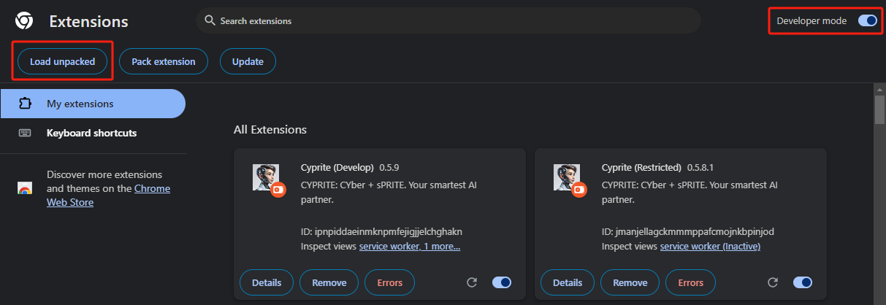
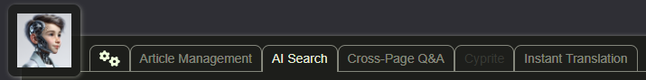
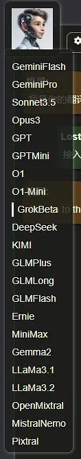
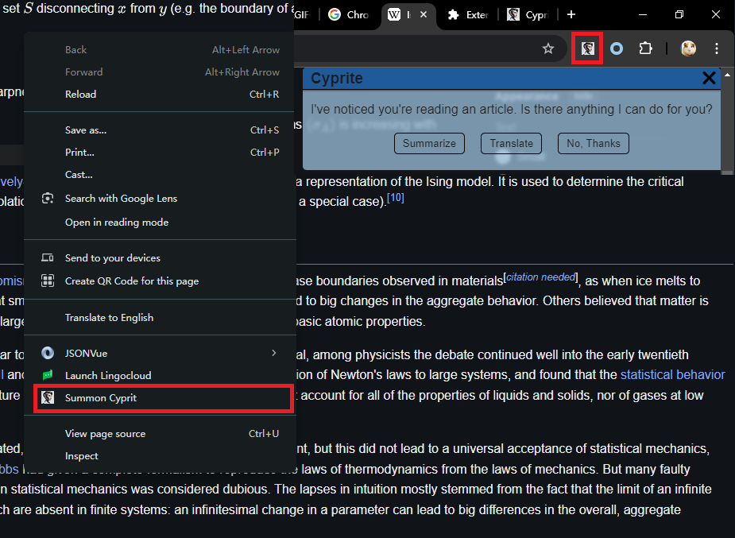
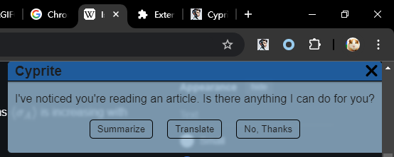
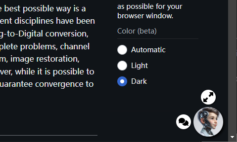
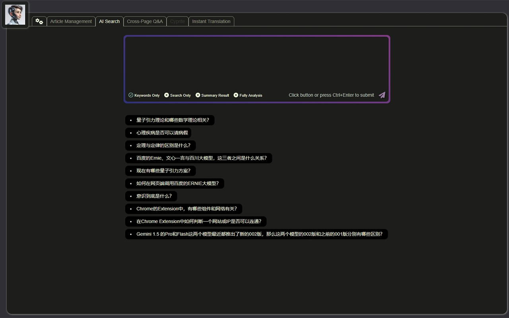
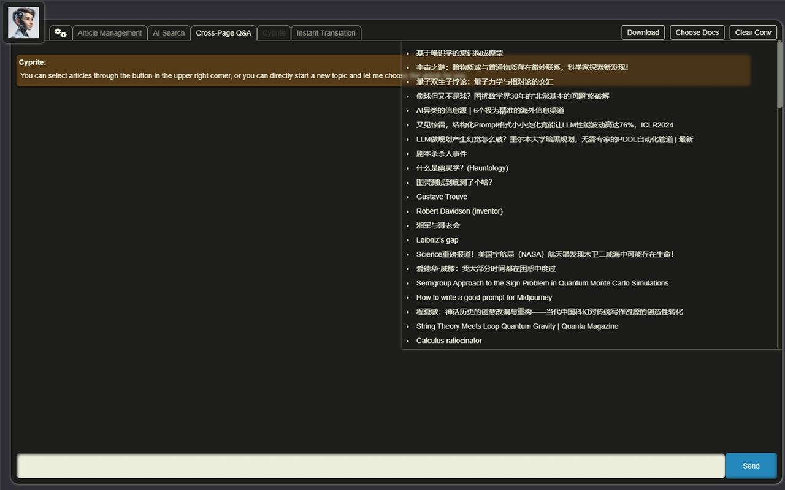
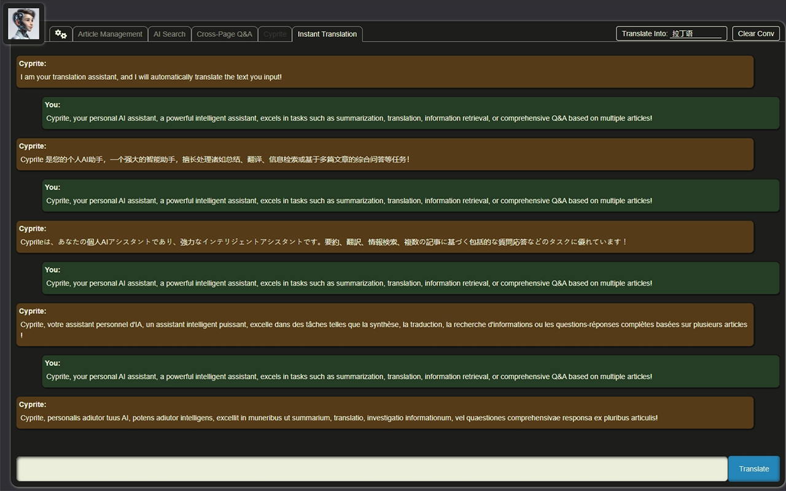
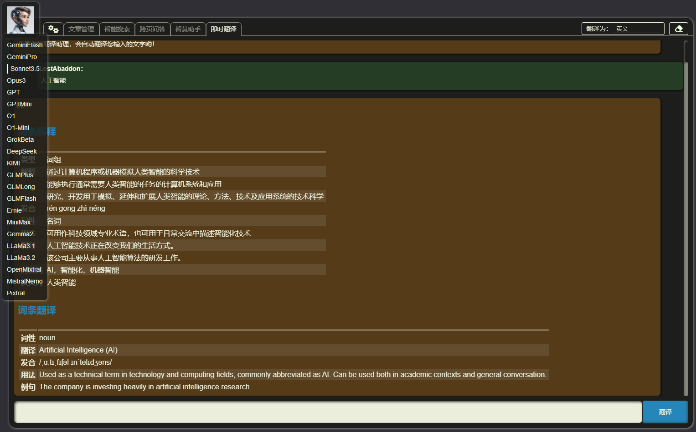

<a href="./README_ZH.html"><button>中文版</button></a>

----

# Cyprite

> - Author: LostAbaddon
> - Version: 0.5.10

I am your best and smartest AI partner, Cyprite.

---

$$
E = M \times C^2
$$

- E: Enlightment
- M: Mind
- C: Cyprite

---

## Restriced and Full Versions

This extension (Cyprite) is divided into RESTRICTED version and FULL version. The restricted version can be downloaded from the [Chrome Extension Store](https://chromewebstore.google.com/detail/cyprite/mkelalclfpkmmfedmfjhdbanjlhfoamg), while the full version can currently only be obtained by contacting us. Contact details can be found at the bottom of this document.

**The differences between RESTRICTED version and FULL version:**

1. The full version includes an AI assistant built using the CoT (Chain of Thought) and PaC (Prompt as Coding) approach, which has deep thinking, reflective capabilities, and the ability to learn and rewrite its own prompts;
2. The "intelligent search" feature in the full version allows the use of the "intelligent analysis" function. This analysis employs the CoT approach in both prompt design and program flow to provide more detailed, comprehensive, and in-depth reasoning;
3. All prompts in the full version are more efficient and detailed, significantly maximizing the AI's capabilities and providing more valuable feedback;
4. The full version can connect to more AI platforms and assign different AIs to different tasks based on various functions to complete tasks in the most efficient manner.

## How to Use

### Installation

If you want to use the restricted version, you can install it directly from the [Chrome Extension Store](https://chromewebstore.google.com/detail/cyprite/mkelalclfpkmmfedmfjhdbanjlhfoamg).

If you want to use the full version, you can contact us to obtain the ZIP package and then unzip it. Next, select "Manage Extensions" under the "Extensions" option in the browser menu, make sure the "Developer Mode" in the upper right corner is checked, and finally choose "Load Unpacked" to load the root directory of the unzipped extension. This way, you can use the full version of the plugin.

Both the restricted version and the full version can be used on Chrome, Edge, and other Chromium-cored browsers.

### Configuration

When using Cyprite for the first time, you need to perform initial setup, including filling in your APIKeys for various AI platforms.

If you didn't set it up the first time, don't worry. You can enter the configuration page by clicking the first button on the left (the first button to the right of the Cyprite avatar) in the top navigation bar of the new page we provide for you.

In the **"Personal Information"** tab, you can set your preferred name and common phrases, as well as information about yourself that you want Cyprite to know, which will help Cyprite communicate better.

In the **"AI APIKey"** tab, you can enter your APIKeys obtained from various AI platforms. Only AIs with APIKey will be used.

It's worth noting that in the Full Version, if you have set up APIKeys for Zhipu (GLM) or Moonshot, their search interfaces will be automatically called when performing searches to improve search quality. For detailed information, please see the "Intelligent Search" section later.

In the **"Plugin Management"** tab, you can enter the APIKey and CX (project code) for your Google Custom Search project. When the APIKey and CX are set, Cyprite will use Google's custom search engine for web searches; otherwise, it will automatically perform covert searches through the browser.

The **"Knowledge Base"** tab is only available in the Full Version. Here you can configure the WebAPI interface address of your local knowledge base. Once set up, Cyprite will automatically search the local knowledge base during cross-page conversations and intelligent search functions to enhance the accuracy of responses.

**Rest assured: Cyprite will not leak your APIKey when calling AI, and when connecting to our official local knowledge base, the knowledge base will not leak your personal information or APIKey. But please make sure the local knowledge base you connect to is official.**

In the **"About"** tab, in addition to information about this extension program, you'll also find the current token usage of various AI platforms, as well as options to export and import current configuration information.

### Selecting Models

After completing the setup, we can switch models by moving the mouse over the Cyprite avatar on the far left of the top navigation bar on the new page. The model selection bar will automatically pop up, allowing you to make your selection.

The AI platforms we can currently connect to include:

- **Gemini**: Flash 1.5, Pro 1.5
- **OpenAI**: o1 Preview, o1 Mini, GPT-4o, GPT-40 mini
- **Anthropic**: Claude 3.5 Sonnet, Claude 3 Opus
- **Grok**: Grok Beta
- **Mistral**: open-mixtral-8x22b, open-mistral-7b, open-mistral-nemo, pixtral-12b-latest, open-codestral-mamba
- **Groq**：gemma2-9b-it, llama3-groq-70b-8192-tool-use-preview, llama-3.1-70b-versatile, llama-3.2-90b-vision-preview
- **MoonShot** (Full Version only): moonshot-v1-auto, moonshot-web-search
- **DeepSeek** (Full Version only): deepseek-chat, deepseek-coder
- **GLM** (Full Version only): glm-4-plus, glm-4-long, glm-4-flash, glm-web-search-pro
- **MiniMax** (Full Version only): abab6.5s-chat
- **Qwen** (Full Version only)：qwen-max, qwen-long, qwen-turbo
- **Ernie** (Full Version only): ernie-4.0-8k

Most models are optional, while some models can only be used covertly in the Full Version, such as `open-codestral-mamba` and `deepseek-coder` for writing code.

In the Full Version, some specific functional tasks will be executed according to a prioritized list of models that we have tested for best results, rather than solely based on the model you choose. This is done to ensure that Cyprite can provide the best service.

### In-Page Services

One of Cyprite's main functions is to provide intelligent services on the page you are browsing, including summarization, Q&A, and translation.

You can invoke the service through the Cyprite button in the top right corner of the browser, or by using the shortcut key `Ctrl + Y`, or by right-clicking on a blank area of the page to summon Cyprite.

After invoking Cyprite, you can choose to summarize the current page, directly translate the current page, or translate selected text.

After summarizing the page, you can also have a conversation with Cyprite based on the current page content. Cyprite will strictly respond according to the current page content, helping you better understand the page content.

At the same time, all pages that have been summarized will have their information saved in the browser, serving as an information source for subsequent cross-page and intelligent search services. Additionally, Cyprite's avatar will appear in the bottom right corner of the page as a quick service entry point.

### New Page

Another important entry point for Cyprite is the browser's new page.

On the new page, you can:

- Choose AI models
- Enter the configuration page
- Perform intelligent searches
- Engage in multi-page conversations
- Access the full-featured intelligent assistant Cyprite (Full Version only)
- Translate

#### Intelligent Search

The intelligent search page offers four modes:

1. Only provide search keywords
2. Only perform search
3. Summary Result
4. Intelligent analysis (Full Version only)

In the "Summary Result" and "Intelligent Analysis" modes, Cyprite will call Google's Custom Search engine to perform searches (if no Custom Search APIKey is provided, it will use a front-end covert webpage reading method for searching), and will also call AI search engines such as GLM and Moonshot for intelligent searching.

In "Summary Result" mode, Cyprite will provide a comprehensive response based on the search results, but will not read the webpage content of the search results.

In "Intelligent Analysis" mode, Cyprite will not only read all the webpages from the search results but will also use front-end RAG technology to recall the content of all previously summarized webpages. When connected to a local knowledge base, it will also call local files (including webpages, Word documents, PDFs, etc.). It will read all documents from these three sources in sequence and respond to the user's search needs, finally integrating all response results into a summary.

After completing the search, analysis, and response in "Summary Result" and "Intelligent Analysis" modes, users can also engage in further Q&A based on the current search results, and Cyprite will respond to the user's questions based on all search results.

In particular, the Full Version uses a set of CoT (Chain of Thought) prompts during the response process, making the replies more complete and rigorous.

#### Multi-Page Conversation

Here, you can select several webpages that Cyprite has previously summarized, and in the Full Version, if connected to a local knowledge base, you can also select local files from the knowledge base. Then you can have Cyprite engage in conversations within the scope of these materials.

In the Full Version, we have also prepared a set of CoT prompts for Cyprite to ensure that its responses are sufficiently impressive.

#### Intelligent Assistant (Under Development)

This is a Cyprite exclusive to the Full Version. It has a self-iterating CoT+PaC (Prompt as Code) prompt template system that can learn your preferences, initiate conversations autonomously, self-reflect and evolve, and use a wide range of tools, including actively searching for information for you.

In future plans, we will also allow the intelligent assistant to load skill packages and experience packages. This is a newer form of Agent architecture that will make your Cyprite more aligned with your intentions and more flexible and proactive as you use it.

**Stay tuned!**

#### Translation

Here, Cyprite will perform "reflective translation" on long texts, which involves:

1. Initial translation, primarily literal
2. Reflection on the shortcomings and deficiencies in the initial translation, and proposing modifications
3. Second translation based on the shortcomings and deficiencies identified and modifications proposed in step two, with more focus on fluent and free translation

When you have provided APIKeys for more than one AI, the second step of reflection will try to choose a model different from the one you currently selected to ensure reflection from as many different perspectives as possible.

Meanwhile, for short texts, "Dictionary Mode" will be automatically enabled, which provides explanations for given words, along with pronunciation, synonyms, antonyms, and example sentences among other dictionary information, making it convenient for you to learn various languages.

## Shortcuts

- Switch search mode: In the smart search input box, `Alt + Left/Right`
- Switch function pages: In the chat input box or smart search input box, `Ctrl + Alt + Left/Right`

## Privacy Policy

Click [here](./PRIVACY.md) to view.

## Update Log

Click [here](./CHANGELOG.md) to view.

## Next Steps

- **1.0.0**
  1. Improve all basic functions
  2. Add local knowledge base support
  3. Integration with VSC, Obsidian, and other Cyprite plugins

## Contact Us

- **Email**: [LostAbaddon](mailto:lostabaddon@gmail.com)
- **Extension Website**: [Cyprite](https://agifoundation.github.io/Cyprite/)
- **Git Repo**: [Github](https://github.com/AGIFOUNDATION/Cyprite)
- **Extension Store**: [Cyprite](https://chromewebstore.google.com/detail/cyprite-restricted/mkelalclfpkmmfedmfjhdbanjlhfoamg)