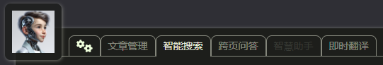
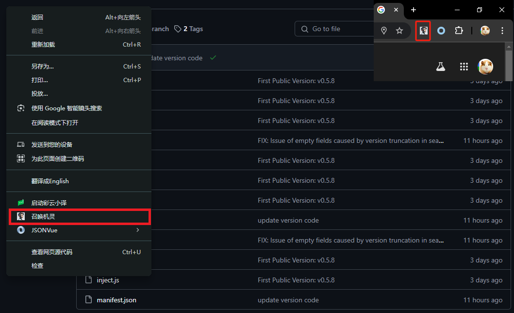
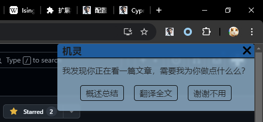
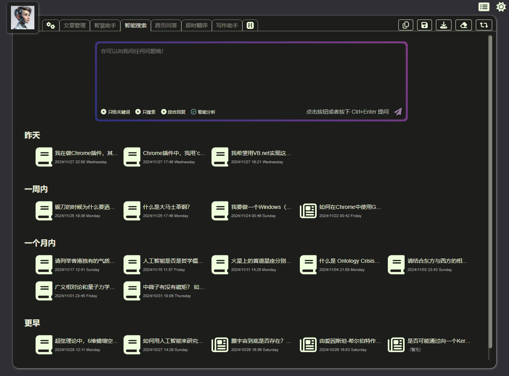
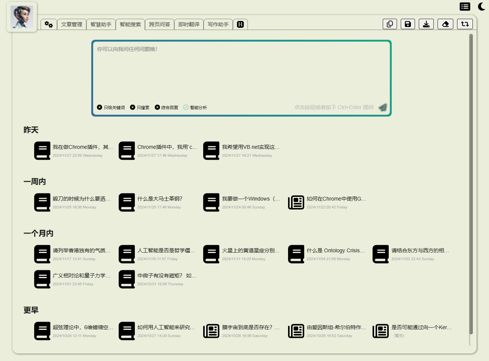
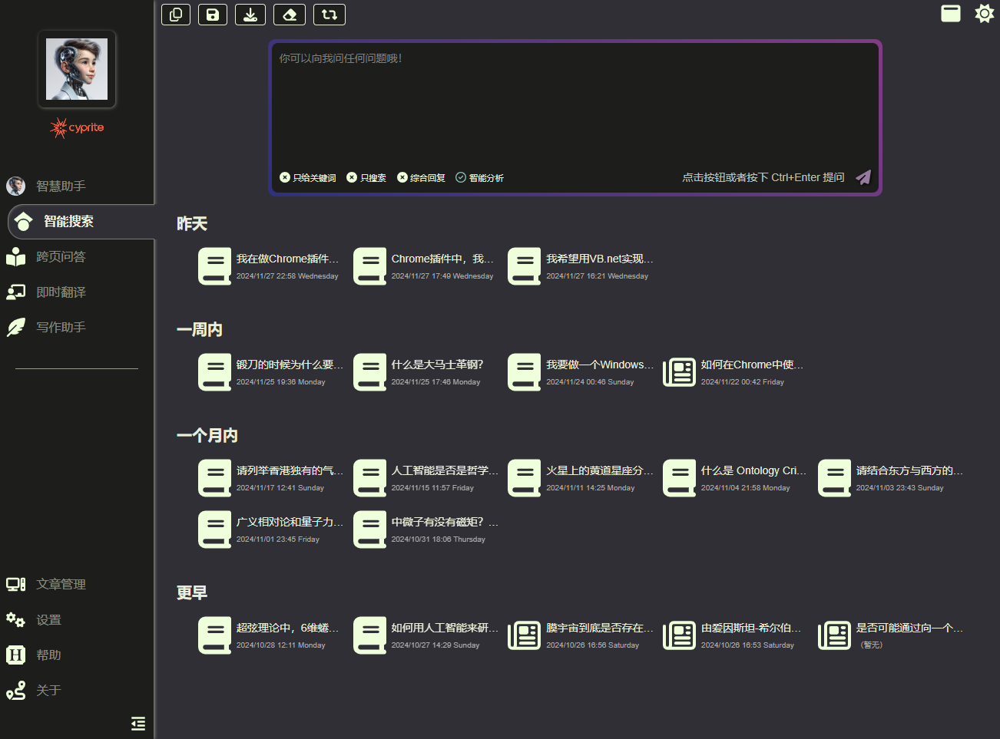
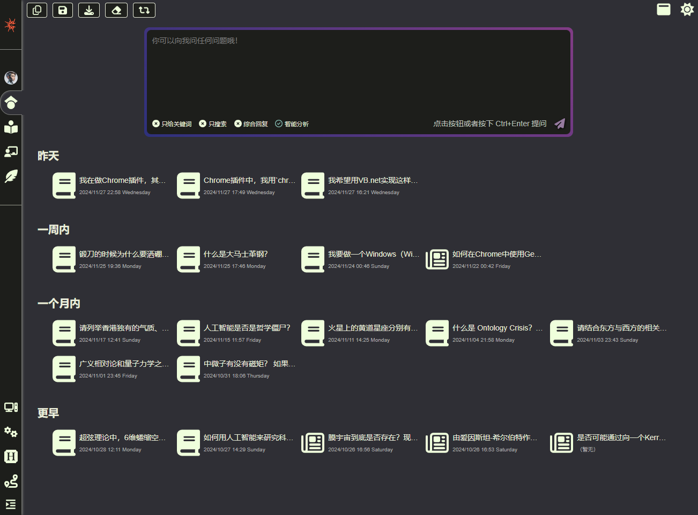
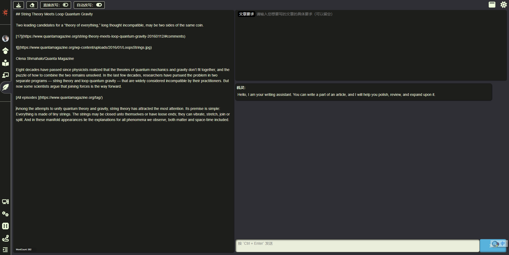
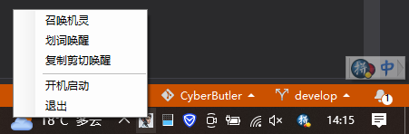
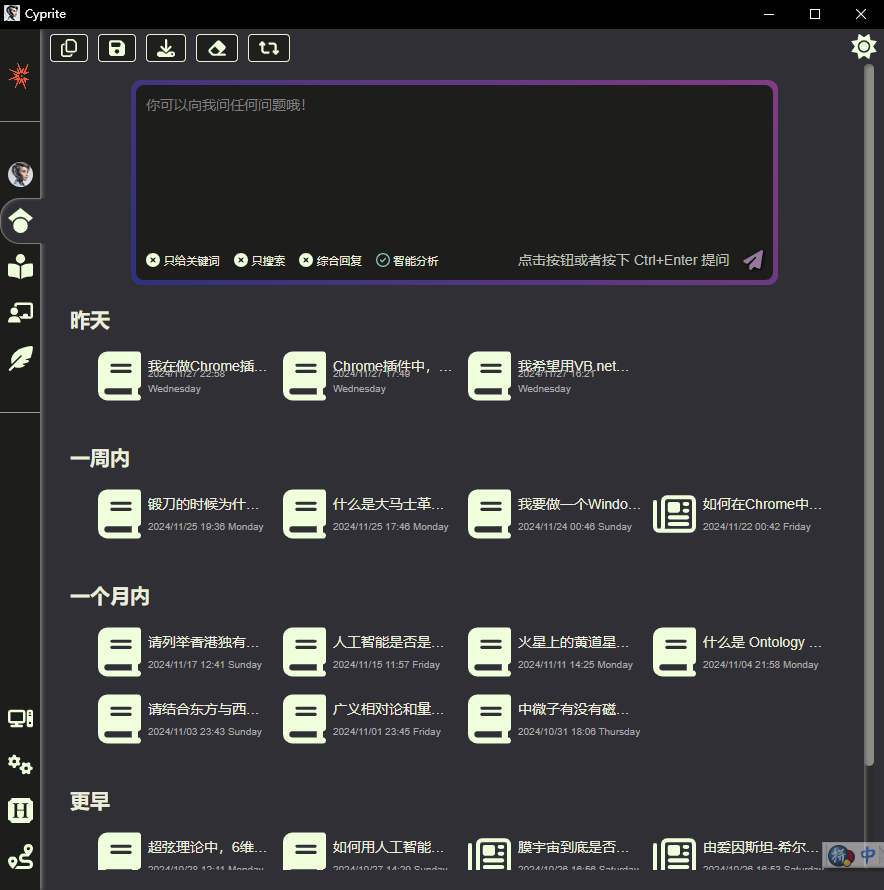

<a href="./"><button>English</button></a>

----

# 机灵（Cyprite）

> - Author: LostAbaddon
> - Version: 1.0.0

我是您最好最聪明的AI伙伴，机灵（Cyprite）。

“Cyprite”就是“Cyber”+“Sprite”，“机灵”就是“机器”+“精灵”，也表示Cyprite的头脑很机灵！

---

$$
E = M \times C^2
$$

- E: Enlightment
- M: Mind
- C: Cyprite

---

## 版本说明

本拓展程序分为受限版与完整版，其中受限版可以在[拓展程序商店](https://chromewebstore.google.com/detail/cyprite/mkelalclfpkmmfedmfjhdbanjlhfoamg)下载，完整版目前只能联系我们获得。联系方式详见本文档底。

**受限版与完整版的区别：**

1. 完整版包含一个使用思维链（Chain of Thought，CoT）、提示即编码（Prompt as Coding，PaC）、程序化提示语工程（Programmatic Prompt Engineering，PPE）等方法构建的人工智能助手，它具有深度思考、反思能力，以及学习和重写自身提示的能力；
2. 完整版中的"智能搜索"功能允许使用"智能分析"功能。这种分析在提示设计和程序流程中都采用了思维链方法，以提供更详细、全面和深入的推理；
3. 完整版中的所有提示都更加高效和详细，显著地最大化了人工智能的能力，并提供更有价值的反馈；
4. 完整版接入了更多的人工智能平台，并根据不同的功能将不同的人工智能分配给不同的任务，以最高效的方式完成任务。

无论哪个版本，都提供以下这几种唤起Cyprite的方法：

- 页面内服务
- 浏览器主入口（新建页）
- 系统托盘（Windows上须安装 **Cyprite应用** ，Mac 上还须等待一段时间）
- 划词激活
- 复制剪切激活

## 使用说明

### 安装

如果您想使用的是受限版，可以直接在[拓展程序商店]((https://chromewebstore.google.com/detail/cyprite/mkelalclfpkmmfedmfjhdbanjlhfoamg))进行安装。

如果您想使用的是完整版，则可以联系我们获取ZIP包后解压，接着选中浏览器选项菜单的“拓展程序”下的“管理拓展程序”，确认右上角已经点选“开发者模式”，最后选择“加载已解压的拓展程序”来加载解压后的拓展程序根目录，这样就能使用完整版插件了。

无论是受限版还是完整版，在Chrome与Edge等Chromium框架的浏览器上都可以使用。

### 配置

第一次使用时，您需要进行初始化设置，包括填写您的各AI平台的APIKey。

如果您第一次没有进行设置也不用担心，您可以我们为您提供的新建页面的顶部导航条中，点击左侧第一个按钮（也即机灵头像右侧第一个按钮）来进入配置页。

在 **“个人信息”** 标签页，您可以设置您的称呼和常用语，以及您希望机灵了解的关于您的信息，这将有助于机灵更好地进行交流。

在 **“AI APIKey”** 标签页，您可以输入您在各AI平台申请到的APIKey。只有设置了APIKey的AI才会被使用。

值得注意的是，在完整版中，如果您设置了智谱（GLM）或者月之暗面（MoonShot）的APIKey，则在进行搜索的时候会自动调用它们的搜索接口，以提高搜索质量。详细信息请看后面“智慧搜索”的介绍条目。

在 **“插件管理”** 标签页，您可以输入您的Google自定义搜索（Custom Search）项目的APIKey与CX（项目代号）。在设置了APIKey与CX后，机灵会使用Google的自定义搜索引擎进行网络搜索，否则则会自动通过浏览器进行隐蔽式搜索。

**“知识库”** 标签页是只有完整版才有的，在这里您可以配置您的本地知识库的WebAPI接口地址，设置了后机灵会在跨页面对话和智能搜索功能中自动搜索本地知识库，以增强回复内容的准确性。

**请放心：机灵在调用AI时不会泄露您的APIKey，在连接到我们官方的本地知识库时，知识库也不会泄露您的个人信息或APIKey。但请确保您连接的本地知识库来自官方。**

在 **“关于”** 标签页，除了关于本拓展程序的介绍，还会当前各AI平台的Token使用量，以及当前配置信息的导出与载入。

### 模型选择

在完成设置后，我们可以在新建页面的顶部导航条最左侧的机灵头像上进行切换，具体做法是将鼠标移动到头像上，模型选择条会自动弹出，然后您便可以进行选择了。

我们目前能接入的AI平台包括：

- **Gemini**：Flash 1.5，Pro 1.5, Exp 1121, LearnLM
- **OpenAI**：o1 Preview，o1 Mini，GPT-4o，GPT-40 mini
- **Anthropic**：Claude 3.5 Sonnet，Claude 3.5 Haiku，Claude 3 Opus
- **Grok**: Grok Beta
- **Mistral**：open-mixtral-8x22b，open-mistral-7b，open-mistral-nemo，pixtral-12b-latest，open-codestral-mamba
- **Groq**：gemma2-9b-it，llama3-groq-70b-8192-tool-use-preview，llama-3.1-70b-versatile，llama-3.2-90b-vision-preview
- **MoonShot**（仅限完整版）：moonshot-v1-auto，moonshot-web-search
- **DeepSeek**（仅限完整版）：deepseek-chat，deepseek-coder
- **GLM**（仅限完整版）：glm-4-plus，glm-4-long，glm-4-flash，glm-web-search-pro
- **MiniMax**（仅限完整版）：abab6.5s-chat
- **Qwen**（仅限完整版）：qwen-max，qwen-long，qwen-turbo
- **Ernie**（仅限完整版）：ernie-4.0-8k

大部分模型都是可选的，而部分模型只能在完整版中被隐藏式地使用，比如写代码时会调用 `open-codestral-mamba` 、 `deepseek-coder` 等。

在完整版中，一些具体的事务功能会优先根据我们测试后效果最好的模型顺序列表来依次执行，而不会只根据您选择的模型来进行执行。这么做是为了确保机灵能提供最好的服务。

### 页面内服务

机灵的一个主要作用，便是在您正在浏览的页面上可以提供包括概述、问答、翻译在内的智能服务。

您可以通过浏览器右上方的机灵按钮来唤起服务，或者通过快捷键 `Ctrl + Y` 来唤起机灵，也可以在页面空白处右键来召唤机灵。

唤起机灵后，您可以选择是对当前页面进行总结概述，还是直接翻译当前页面，或者对划选中的文字进行翻译。

在对页面进行总结概述后，您还可以根据当前页面内容与机灵进行对话，机灵也会严格根据当前页面内容进行回复，帮助您更好地理解页面内容。

与此同时，所有进行过总结概述的页面，其信息也会被保存在浏览器中，作为后续跨页面与智能搜索服务的信息源。同时在页面的右下角也会出现机灵的头像，作为快捷服务入口。

### 浏览器主入口

机灵的另一个重要入口，就是浏览器的新建页。

在新建页中，您可以：

- 选择AI模型
- 进入配置页
- 全功能智能助手Cyprite（仅限完整版）
- 智能搜索
- 多页面对话
- 智能翻译
- 智能写作助手
- 问答帮助页

同时，该入口页面分为顶部横向导航条模式（简称为“上下布局”）与左侧导航条模式（简称为“左右布局”）两种布局主题，以及“亮色”与“暗色”两种主题。左右布局模式下我们还可以将左侧导航条缩小，让外观更加简洁。布局主题与颜色主题都可以通过右上角的主题选择按钮进行切换，且上下布局中布局主题与颜色主题的切换按钮会自动隐藏，鼠标放到页面右上角时会自动唤出。

**上下布局暗色主题：**

**上下布局亮色主题：**

**左右布局暗色主题且导航区展开：**

**左右布局暗色主题且导航区缩进：**

#### 智能搜索

在智能搜索页，提供四种模式的搜索：

1. 仅提供搜索关键词
2. 仅进行搜索
3. 综合回复
4. 智能分析（仅限完整版）

在“综合回复”与“智能分析”这两种模式中，机灵会调用Google的自定义搜索（Custom Search）引擎进行搜索（没有提供自定义搜索的APIKey时会使用前端隐蔽式读网页的方式进行搜索），也会调用AI搜索引擎比如GLM和月之暗面，进行智能搜索。

在“综合回复”模式中，机灵会根据搜索结果进行综合回复，但不会读取搜索结果的网页内容。

而在“智能分析”模式中，机灵不但会读取所有搜索结果的网页，还会通过前端RAG技术来召回曾经总结概述过的所有网页的内容，在连接到本地知识库时还会调用本地文件（包括网页、Word文档、PDF，等等），将所有上述这三个来源的文档依次阅读并针对用户的搜索需求进行回复，最后将所有回复结果整合在一起做出总结。

“综合回复”与“智能分析”在完成搜索、分析、回复后，用户也可以基于当前搜索结果进行进一步的问答，而机灵也会根据所有搜索结果对用户的提问做出回答。

尤其，完整版在回复过程中，会使用一套CoT（思维链）提示语，让回复更加完整与严谨。

#### 多页面对话

在这里，您可以选择若干曾经让机灵总结概述过的网页，在完整版中如果连接了本地知识库则还可以选择知识库中的本地文件，然后让机灵在这些资料的范围内进行对话。

在完整版中，我们同样为机灵准备了一套CoT提示语，确保机灵的回复足够精彩。

#### 智能助手（完整版提供所有功能）

这是完整版独有的机灵，它拥有可以自我迭代、自我学习、自动经验总结的CoT+PaC+PPE的智能系统，能学习您的喜好，自主发起对话，自主反省与更迭，并能使用大量工具，包括主动为您搜索资料等。

在未来的规划中，我们还会允许智能助手通加载技能包与经验包，这是一种更新形式的Agent架构，会让您的机灵越用越符合您的心意，越用越灵活主动。

**敬请期待！**

#### 智能翻译

智能翻译有三种翻译模式，且会自动进行选择：

1. 辞典模式：会像辞典一样列出待翻译词汇与翻译结果的词性、用法、例句等信息，方便您学习
2. 简单模式：对简单句子会进行单次直翻
3. 认真模式：会先分析内容的类型与使用场景，然后进行初次翻译，并分析初次翻译结果的不足与可优化之处，最后结合这两步的结果给出最终翻译

当您提供了不止一个AI的APIKey时，第二步反思会尽量选择与当前您所选择的模型不同的模型，以确保能尽量多地从不同角度来进行反思。

#### 写作助手

在写作助手中，界面分为三个主要区域：左侧的内容编辑区，右侧上方的文章要求区和右侧下方的对话区。

Cyprite会根据文章要求与对话历史，对当前内容作出润色、修改甚至续写与全文改写。

同时我们可以通过上方的两个开关“直接改写”与“自动改写”来调整Cyprite的工作方式：如果选中“直接改写”，则Cyprite会将所有修改意见应用到当前正文上，从而你能直接看到修改结果，否则您只能在对话区中看到Cyprite给出的修改意见然后手动调整。而如果选中“自动改写”，则当用户在内容编辑区完成编辑后如果一段时间内没有进一步的操作，则Cyprite会自动根据当前内容作出调整。

### 本地应用程序

如果希望Cyprite能更好地为您符合，您可以安装本地应用程序。目前Windows版已完成开发，Linux与Mac版还需要稍候一段时间。 **未来我们还会提供手机端应用，敬请期待！**

本地应用程序提供如下功能：

- 托盘入口
- 划词激活（可开关）
- 复制剪切激活（可开关）
- 开机自动启动（可开关）
- 本地文件读取与学习（开发中）
- 读取当前屏幕全部或部分内容（开发中）
- 本地私有数据中心（开发中，且所有数据都只在本地使用，不会上传到云端）
- 手机端、本地端、网页端数据整合（开发中）

**注意：**

- Windows端需要 .Net 4.8 运行时支持

**获取途径：**

有完整版使用权限的用户可以在 [REPO](https://github.com/AGIFOUNDATION/CyberButler) 的`vsp`目录中获取源码并自行编译或二次开发（请遵守相关开源协议）。

没有完整版使用权限的用户可以点击[这里](./assets/cyprite.windows.zip)下载公开版。

## 快捷键

- 切换搜索模式：在智能搜索输入框内，`Alt + Left/Right`
- 切换功能页：在对话输入框或智能搜索输入框内，`Ctrl + Alt + Left/Right`

## 隐私政策

点击[Privacy Policy](./PRIVACY.md)查看。

## 更新日志

点击[ChangeLog](./CHANGELOG.md)查看。

## 下一步计划

-	**1.0.0**
	1. 完善所有基础功能
	2. 增加本地知识库支持
	3. 与VSC、Obsidian等Cyprite插件打通

## 联系方式

- **Email**: [LostAbaddon](mailto:lostabaddon@gmail.com)
- **插件网站**: [Cyprite](https://agifoundation.github.io/Cyprite/)
- **REPO**: [Github](https://github.com/AGIFOUNDATION/Cyprite)
- **浏览器插件商店页**: [Cyprite](https://chromewebstore.google.com/detail/cyprite-restricted/mkelalclfpkmmfedmfjhdbanjlhfoamg)