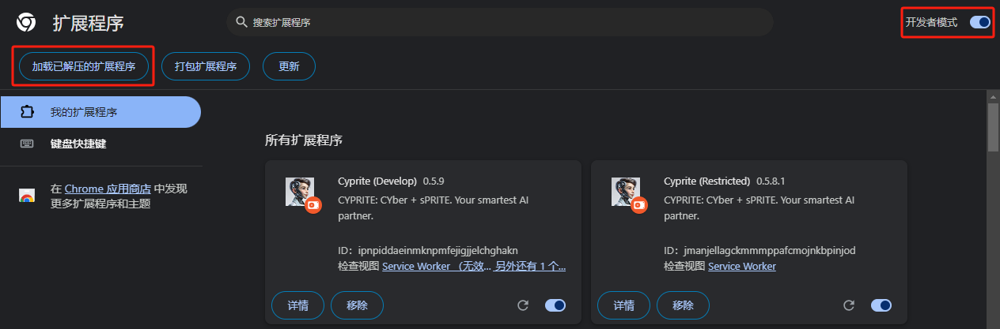
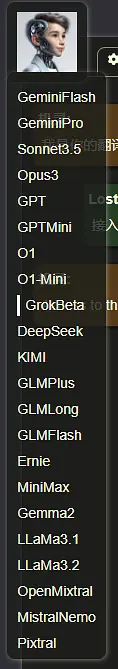
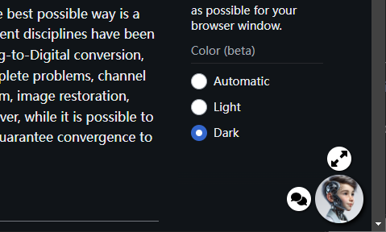
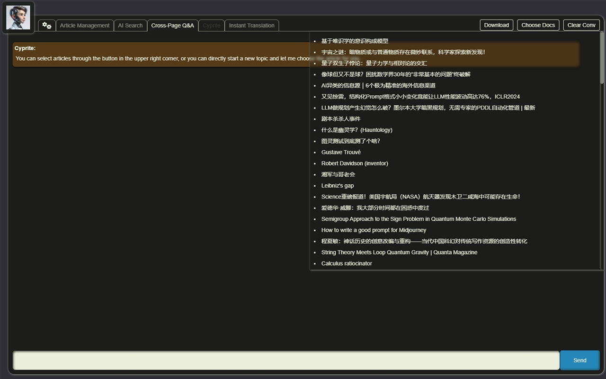
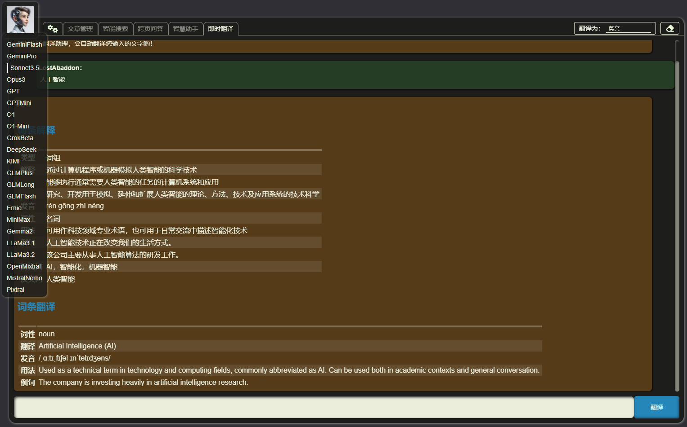

<a href="./"><button>English</button></a>

----

# 机灵（Cyprite）

> - Author: LostAbaddon
> - Version: 0.5.10

我是您最好最聪明的AI伙伴，机灵（Cyprite）。

---

$$
E = M \times C^2
$$

- E: Enlightment
- M: Mind
- C: Cyprite

---

## 版本说明

本拓展程序分为受限版与完整版，其中受限版可以在[拓展程序商店](https://chromewebstore.google.com/detail/cyprite/mkelalclfpkmmfedmfjhdbanjlhfoamg)下载，完整版目前只能联系我们获得。联系方式详见本文档底。

**受限版与完整版的区别：**

1. 完整版包含一个使用思维链（Chain of Thought，CoT）和提示即编码（Prompt as Coding，PaC）方法构建的人工智能助手，它具有深度思考、反思能力，以及学习和重写自身提示的能力；
2. 完整版中的"智能搜索"功能允许使用"智能分析"功能。这种分析在提示设计和程序流程中都采用了思维链方法，以提供更详细、全面和深入的推理；
3. 完整版中的所有提示都更加高效和详细，显著地最大化了人工智能的能力，并提供更有价值的反馈；
4. 完整版接入了更多的人工智能平台，并根据不同的功能将不同的人工智能分配给不同的任务，以最高效的方式完成任务。

## 使用说明

### 安装

如果您想使用的是受限版，可以直接在[拓展程序商店]((https://chromewebstore.google.com/detail/cyprite/mkelalclfpkmmfedmfjhdbanjlhfoamg))进行安装。

如果您想使用的是完整版，则可以联系我们获取ZIP包后解压，接着选中浏览器选项菜单的“拓展程序”下的“管理拓展程序”，确认右上角已经点选“开发者模式”，最后选择“加载已解压的拓展程序”来加载解压后的拓展程序根目录，这样就能使用完整版插件了。

无论是受限版还是完整版，在Chrome与Edge等Chromium框架的浏览器上都可以使用。

### 配置

第一次使用时，您需要进行初始化设置，包括填写您的各AI平台的APIKey。

如果您第一次没有进行设置也不用担心，您可以我们为您提供的新建页面的顶部导航条中，点击左侧第一个按钮（也即机灵头像右侧第一个按钮）来进入配置页。

在 **“个人信息”** 标签页，您可以设置您的称呼和常用语，以及您希望机灵了解的关于您的信息，这将有助于机灵更好地进行交流。

在 **“AI APIKey”** 标签页，您可以输入您在各AI平台申请到的APIKey。只有设置了APIKey的AI才会被使用。

值得注意的是，在完整版中，如果您设置了智谱（GLM）或者月之暗面（MoonShot）的APIKey，则在进行搜索的时候会自动调用它们的搜索接口，以提高搜索质量。详细信息请看后面“智慧搜索”的介绍条目。

在 **“插件管理”** 标签页，您可以输入您的Google自定义搜索（Custom Search）项目的APIKey与CX（项目代号）。在设置了APIKey与CX后，机灵会使用Google的自定义搜索引擎进行网络搜索，否则则会自动通过浏览器进行隐蔽式搜索。

**“知识库”** 标签页是只有完整版才有的，在这里您可以配置您的本地知识库的WebAPI接口地址，设置了后机灵会在跨页面对话和智能搜索功能中自动搜索本地知识库，以增强回复内容的准确性。

**请放心：机灵在调用AI时不会泄露您的APIKey，在连接到我们官方的本地知识库时，知识库也不会泄露您的个人信息或APIKey。但请确保您连接的本地知识库来自官方。**

在 **“关于”** 标签页，除了关于本拓展程序的介绍，还会当前各AI平台的Token使用量，以及当前配置信息的导出与载入。

### 选择模型

在完成设置后，我们可以在新建页面的顶部导航条最左侧的机灵头像上进行切换，具体做法是将鼠标移动到头像上，模型选择条会自动弹出，然后您便可以进行选择了。

我们目前能接入的AI平台包括：

- **Gemini**：Flash 1.5，Pro 1.5
- **OpenAI**：o1 Preview，o1 Mini，GPT-4o，GPT-40 mini
- **Anthropic**：Claude 3.5 Sonnet，Claude 3 Opus
- **Grok**: Grok Beta
- **Mistral**：open-mixtral-8x22b，open-mistral-7b，open-mistral-nemo，pixtral-12b-latest，open-codestral-mamba
- **Groq**：gemma2-9b-it，llama-3.1-70b-versatile，llama-3.2-90b-text-preview
- **MoonShot**（仅限完整版）：moonshot-v1-auto，moonshot-web-search
- **DeepSeek**（仅限完整版）：deepseek-chat，deepseek-coder
- **GLM**（仅限完整版）：glm-4-plus，glm-4-long，glm-4-flash，glm-web-search-pro
- **MiniMax**（仅限完整版）：abab6.5s-chat
- **Ernie**（仅限完整版）：ernie-4.0-8k

大部分模型都是可选的，而部分模型只能在完整版中被隐藏式地使用，比如写代码时会调用 `open-codestral-mamba` 、 `deepseek-coder` 等。

在完整版中，一些具体的事务功能会优先根据我们测试后效果最好的模型顺序列表来依次执行，而不会只根据您选择的模型来进行执行。这么做是为了确保机灵能提供最好的服务。

### 页面内服务

机灵的一个主要作用，便是在您正在浏览的页面上可以提供包括概述、问答、翻译在内的智能服务。

您可以通过浏览器右上方的机灵按钮来唤起服务，或者通过快捷键 `Ctrl + Y` 来唤起机灵，也可以在页面空白处右键来召唤机灵。

唤起机灵后，您可以选择是对当前页面进行总结概述，还是直接翻译当前页面，或者对划选中的文字进行翻译。

在对页面进行总结概述后，您还可以根据当前页面内容与机灵进行对话，机灵也会严格根据当前页面内容进行回复，帮助您更好地理解页面内容。

与此同时，所有进行过总结概述的页面，其信息也会被保存在浏览器中，作为后续跨页面与智能搜索服务的信息源。同时在页面的右下角也会出现机灵的头像，作为快捷服务入口。

### 新建页面

机灵的另一个重要入口，就是浏览器新建页面。

在新建页面中，您可以：

- 选择AI模型
- 进入配置页
- 智能搜索
- 多页面对话
- 全功能智能助手Cyprite（仅限完整版）
- 翻译

#### 智能搜索

在智能搜索页，提供四种模式：

1. 仅提供搜索关键词
2. 仅进行搜索
3. 综合回复
4. 智能分析（仅限完整版）

在“综合回复”与“智能分析”这两种模式中，机灵会调用Google的自定义搜索（Custom Search）引擎进行搜索（没有提供自定义搜索的APIKey时会使用前端隐蔽式读网页的方式进行搜索），也会调用AI搜索引擎比如GLM和月之暗面，进行智能搜索。

在“综合回复”模式中，机灵会根据搜索结果进行综合回复，但不会读取搜索结果的网页内容。

而在“智能分析”模式中，机灵不但会读取所有搜索结果的网页，还会通过前端RAG技术来召回曾经总结概述过的所有网页的内容，在连接到本地知识库时还会调用本地文件（包括网页、Word文档、PDF，等等），将所有上述这三个来源的文档依次阅读并针对用户的搜索需求进行回复，最后将所有回复结果整合在一起做出总结。

“综合回复”与“智能分析”在完成搜索、分析、回复后，用户也可以基于当前搜索结果进行进一步的问答，而机灵也会根据所有搜索结果对用户的提问做出回答。

尤其，完整版在回复过程中，会使用一套CoT（思维链）提示语，让回复更加完整与严谨。

#### 多页面对话

在这里，您可以选择若干曾经让机灵总结概述过的网页，在完整版中如果连接了本地知识库则还可以选择知识库中的本地文件，然后让机灵在这些资料的范围内进行对话。

在完整版中，我们同样为机灵准备了一套CoT提示语，确保机灵的回复足够精彩。

#### 智能助手（研发完善中）

这是完整版独有的机灵，它拥有可以自我迭代的CoT+PaC（提示语即代码）提示语模板系统，能学习您的喜好，自主发起对话，自主反省与更迭，并能使用大量工具，包括主动为您搜索资料等。

在未来的规划中，我们还会允许智能助手通加载技能包与经验包，这是一种更新形式的Agent架构，会让您的机灵越用越符合您的心意，越用越灵活主动。

**敬请期待！**

#### 翻译

在这里，机灵会对长文本进行“反思式翻译”，即：

1. 初步翻译，以直译为主
2. 反思初步翻译中的不足与缺陷，并提出修改意见
3. 根据第二部找出的不足与缺陷以及提出的修改意见，进行二次翻译，更注重流畅意译

当您提供了不止一个AI的APIKey时，第二步反思会尽量选择与当前您所选择的模型不同的模型，以确保能尽量多地从不同角度来进行反思。

同时，对于短文本会自动启用“辞典模式”，即会对给定词汇做出解释，并给出发音、同义词、反义词和例句等辞典信息，方便您学习各国语言。

## 快捷键

- 切换搜索模式：在智能搜索输入框内，`Alt + Left/Right`
- 切换功能页：在对话输入框或智能搜索输入框内，`Ctrl + Alt + Left/Right`

## 隐私政策

点击[Privacy Policy](./PRIVACY.md)查看。

## 更新日志

点击[ChangeLog](./CHANGELOG.md)查看。

## 下一步计划

-	**1.0.0**
	1. 完善所有基础功能
	2. 增加本地知识库支持
	3. 与VSC、Obsidian等Cyprite插件打通

## 联系方式

- **Email**: [LostAbaddon](mailto:lostabaddon@gmail.com)
- **插件网站**: [Cyprite](https://agifoundation.github.io/Cyprite/)
- **REPO**: [Github](https://github.com/AGIFOUNDATION/Cyprite)
- **浏览器插件商店页**: [Cyprite](https://chromewebstore.google.com/detail/cyprite-restricted/mkelalclfpkmmfedmfjhdbanjlhfoamg)